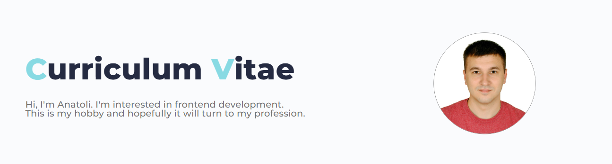

## 👋 Hi, I’m Anatoli
### 💬 About myself
 👀 I’m interested in Frontend Development
 🌱 I’m result-oriented and opened to new knowledge
 💻 I'm ready to do my best to become a Frontend Developer
 🔭 I’m currently learning TS/React                       
### 📫 How to reach me
- __Phone:__ +375298244325
- __E-mail:__ [humanities5050@gmail.com](humanities5050@gmail.com)
- __LinkedIn:__ [Anatoli Paliukhovich](https://www.linkedin.com/in/anatoli-paliukhovich-545b07215/)
- __Discord:__ [Anatoli Paliukhovich](https://discordapp.com/users/anatoli0243)
- __Telegram:__ [Anatoli Paliukhovich](https://t.me/Anatoli_Paliukhovich)
### Languages and Tools
                
### My Projects
 Project title            |   Deploy link
--------------------------|:-----------------------:
CV                        |   [Curriculum Vitae](https://Anatoli-Paliukhovich.github.io/rsschool-cv/)
Self-introduction(EN)     |   [Video/text](https://rolling-scopes-school.github.io/anatoli-paliukhovich-JSFE2023Q4/self-introduction/)
Coffee house              |   [Coffee house](https://rolling-scopes-school.github.io/anatoli-paliukhovich-JSFE2023Q4/coffee-house)
Custom Audio Player       |   [Audio-player](https://rolling-scopes-school.github.io/anatoli-paliukhovich-JSFEPRESCHOOL2023Q2/js30audioplayer/)
Image gallery             |   [Image-gallery](https://rolling-scopes-school.github.io/anatoli-paliukhovich-JSFEPRESCHOOL2023Q2/js30image-galery/)
Library                   |   [Library](https://rolling-scopes-school.github.io/anatoli-paliukhovich-JSFEPRESCHOOL2023Q2/library/)
CssMemSlider              |   [CssMemSlider](https://anatoli-paliukhovich.github.io/cssMemeSlider/cssMemeSlider/index.html)
Random game               |   [Flappy bird](https://rolling-scopes-school.github.io/anatoli-paliukhovich-JSFEPRESCHOOL2023Q2/random-game/)
Nonograms game            |   [Nonograms](https://rolling-scopes-school.github.io/anatoli-paliukhovich-JSFE2023Q4/nonograms)
Hangman game              |   [Hangman](https://rolling-scopes-school.github.io/anatoli-paliukhovich-JSFE2023Q4/hangman)
<!---
Anatoli-Paliukhovich/Anatoli-Paliukhovich is a ✨ special ✨ repository because its `README.md` (this file) appears on your GitHub profile.
You can click the Preview link to take a look at your changes.
--->
